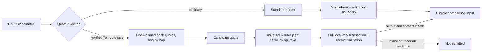

# QuoteBridge

**ETHGlobal Tokyo submission · Uniswap v4 × Tempo**

QuoteBridge helps routing developers recover and verify exact-input quotes for
specific multi-hop Tempo aggregator routes. Given a supported route and input
amount, it produces a candidate quote, compatible Universal Router calldata,
and a full-transaction validation result. A route joins the comparison input
only after its executed output matches the quote. This is a **working standalone
Python prototype** and a **proposed UniRoute integration patch**, not a deployed
Uniswap feature.

## Problem

At Tempo block **41,183,156**, the standard `V4Quoter` could not quote a
25 cUSD → PathUSD → USDT0 route even though a properly funded Universal Router
transaction could execute it. During quote simulation, the first Tempo hook
called `PoolManager.take(cUSD)` before input had been settled. PoolManager held
**19,862,459 raw cUSD**, less than the **25,000,000 raw cUSD** requested, so the
token transfer reverted before a quote was returned. The hook was called:
multi-hop does **not** inherently skip custom-hook logic. This is a missing
quote, not evidence that a successful quote returned the wrong amount.
[Trace and threshold evidence](evidence/quote-harness/REAL_TEMPO_REPORT.md)

## Solution

For explicitly supported Tempo routes, QuoteBridge calls the deployed hook's
`quote()` for each hop at the same pinned block and passes each output into the
next hop. It encodes a complete Universal Router plan with **`SETTLE →
SWAP_EXACT_IN → TAKE`**, then simulates and executes the plan only on a
snapshotted local fork. Receipt transfers, recipient balance changes, and any
output-token gas charge are reconciled before the candidate is admitted to
`comparisonInput`. Failed, missing, or ambiguous validation keeps it out.
Ordinary routes retain the standard quote path.

## Architecture



The Python path above is runnable on a local Tempo fork. The proposed
TypeScript patch supplies dispatch and an injectable admission boundary; its
real production validator is **not wired** into public UniRoute.

## Verified before and after

The table is a **recorded local-fork result**, not a live quote or a claim of
better pricing. All tokens in this case have six decimals.

| 25 cUSD → PathUSD → USDT0 | Standard path | QuoteBridge path |
|---|---|---|
| Quote | `V4Quoter` reverts at the first hook's `PoolManager.take`; no amount | **24,997,499 raw USDT0** candidate |
| Full Router execution | A swap-before-settlement plan fails above the balance threshold | Settlement-before-swap succeeds; recipient gains **24,997,499 raw USDT0** |
| Admission | No quote to compare | Validated candidate enters `comparisonInput`; **316,216 receipt gas units** |

Evidence: [recorded dispatch JSON](demo-results/dispatch_25_cusd.json),
[fork regression](tests/test_tempo_fork.py#L23), and
[baseline trace report](evidence/quote-harness/REAL_TEMPO_REPORT.md). The fork
funded only the test payer to 30 cUSD and 1 ETH native balance; it did **not**
top up PoolManager or Tempo Exchange.

## Uniswap integration and code

- **Running prototype:** [supported-route checks](tempo_quote.py#L179),
  [per-hop hook quoting](tempo_quote.py#L193),
  [Universal Router plan encoding](tempo_quote.py#L234), and
  [full local-fork execution](tempo_quote.py#L339).
  [Quote dispatch](quote_dispatch.py#L122) and
  [receipt-based output reconciliation](quote_dispatch.py#L48) keep candidate
  status separate from execution validation. The
  [CLI demo](dispatch_demo.py#L14) exposes the recorded use case.
- **Proposed UniRoute patch:**
  [route classification and scoped dispatch](patches/uniroute-tempo-multihop.patch#L1),
  [injectable execution-admission interface](patches/uniroute-tempo-multihop.patch#L156),
  and [DeepQuoteStrategy connection](patches/uniroute-tempo-multihop.patch#L318).
  Its [boundary test](scripts/test_upstream_patch.cjs) uses mocks for missing
  private components. It does **not** prove an end-to-end runnable UniRoute
  service. [Patch details and baseline commit](patches/README.md).

We reuse deployed Uniswap v4 **PoolManager**, **V4Quoter**, and **Universal
Router** contracts, plus the real TempoExchangeAggregator hook and Tempo
Exchange behavior on the fork. Public UniRoute already has an exact-input
`SETTLE → SWAP → TAKE` step builder; we did not modify or redeploy Router.
The public UniRoute checkout lacks components needed to run the complete
service and connect its real final-plan validator.

## Quick start

Requires Python **3.12+**, Foundry `anvil` and `cast`, and a Tempo archive RPC
serving the recorded block. Run from this repository root:

```bash
python3 -m venv .venv
.venv/bin/python -m pip install -e .
export PATH="$HOME/.foundry/bin:$PATH"
```

In terminal 1, start a **fresh fork on an unused port**:

```bash
export TEMPO_ARCHIVE_RPC=https://rpc.tempo.xyz
anvil --fork-url "$TEMPO_ARCHIVE_RPC" --fork-block-number 41183156 \
  --timestamp 1790342634 --port 8549 --silent
```

In terminal 2:

```bash
export PATH="$HOME/.foundry/bin:$PATH"
export TEMPO_FORK_RPC=http://127.0.0.1:8549
.venv/bin/python -m unittest discover -s tests -v
.venv/bin/python dispatch_demo.py --rpc "$TEMPO_FORK_RPC" --target USDT0 --amount 25
.venv/bin/python dispatch_demo.py --rpc "$TEMPO_FORK_RPC" --target PathUSD --amount 1
```

The scripts send transactions **only to local Anvil**, then revert their
snapshots; they never broadcast to Tempo. The ordinary-route comparison test
uses boundary mocks, not a real ordinary-route fork measurement. See the
[full demo runbook](DEMO_RUNBOOK.md) for the three evidence levels, the
historical deadline, and the optional TypeScript patch check.

## Scope and provenance

Supported exact-input routes are **cUSD → PathUSD**, **cUSD → PathUSD →
USDT0**, and **cUSD → PathUSD → USDC.e**, using the checked Tempo v1.0 hook
deployment on chain **4217** at block **41,183,156**. Pool IDs, directions,
fee, tick spacing, and block hash are fixed in the adapter. Other hooks,
chains, blocks, route compositions, and exact-output swaps are not claimed.
Independent hop quotes are candidates until full execution validates them.
There is no measured production failure rate, user loss, or net-price saving
against a validated competing route.

**Our additions:** the Python quote/plan/validation boundary, focused tests,
recorded fork results, dashboard, and proposed UniRoute patch. **Upstream
components:** the deployed Uniswap and Tempo contracts and the existing
UniRoute step builder; see the [investigation provenance](evidence/README.md).
**AI assistance:** Codex helped inspect source and traces and draft code,
tests, and documentation. The numeric claims above come from saved RPC/fork
results and tests, not AI estimates.

Explore the [recorded dashboard](dashboard/index.html),
[architecture diagram](#architecture), [admission report](ADMISSION_REPORT.md),
[problem and direction report](PROBLEM_AND_DIRECTION.md),
[real Tempo investigation](evidence/quote-harness/REAL_TEMPO_REPORT.md), and
[developer feedback](FEEDBACK.md).
